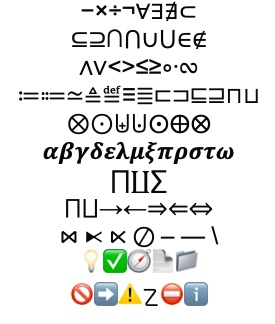

// Signature du document
:sigle: NT-2023-001
:titre: Encodage textuel pour CoLOED
:sous_titre: Choix d’une panoplie logicielle pour la rédaction technique
:organisation: CoLOED
:entrepot: CoLOED
:depot: AsciiDoc
:!branche:
:description: {titre} — {sous_titre}
:outline-title: {sigle} — {description}
:keywords: Conventions documentaires, logiciels de traitement de texte
:revnumber: 1.0.0.b
:revdate: 2024-02-19
:version-label: document de travail, ne pas citer

// Contexte de support du document
include::../../../rep_CoLOED_AsciiDoc.adoc[]

// Format du document
include::{rep_format}/RAPPORT_en-tete.adoc[]

// Préliminaires du document (sommaire, mise en garde, table des matières, etc.)

include::{rep_format}/SOMMAIRE.adoc[]
Le présent documente le choix de l’encodage textuel et de la suite logicielle
à être utilisés pour le développement, le maintien, le partage et l’évolution
des documents et des présentations du CoLOED et corolairement de CoFELI, Μῆτις et MAD.

include::{rep_format}/MISE_EN_GARDE.adoc[]
Le présent document est en cours d’élaboration ;
en conséquence, il est incomplet et peut contenir des erreurs.

include::{rep_format}/HISTO_debut.adoc[]

| 2024-02-19
| LL
| Revue pour diffusion interne.

| 2024-01-24
| LL
| Revue mineure.

| 2023-06-24
| LL
| Ébauche initiale.
include::{rep_format}/HISTO_fin.adoc[]

<<<
toc::[]

// Corps du document
<<<
[introduction]
== Introduction

Le présent document a pour objectif de documenter le cheminement ayant conduit
au choix.

Le mandat repose initialement sur les informations suivantes :

* Documents (modules, exercices, énoncés de travaux, notes, rapports, manuels, etc.)
  - Suggestion : évaluer les notations à balisage léger aussi riche que possible
    (tout en permettant que le document balisé demeure lisible sans traduction).
  - Candidats initiaux : Markdown, AsciiDoc, reStructuredText.
* Présentations
  - Évaluer prioritairement la même solution que pour les documents.
  - La lisibilité du document sans traduction n’est pas un critère.
  - Considérer la qualité de la traduction en HTML et en PDF.
  - Considérer _reveal.js_.
* Figures et diagrammes
  - Considérer PlantUML, Graphviz et DrawIO.
  - Limiter et déterminer les encodages privilégiés (jpg, png, svg, etc.).
* S’assurer d’une traduction de qualité en HTML et en PDF.
* S’assurer de la complémentarité avec GitHub.
* Privilégier les normes, standards, formats, logiciels ouverts et libres de droits.

Par ailleurs, au-delà des besoins de CoFELI,
ceux de Μῆτις, MAD et GRIIS seront aussi pris en compte.

== Méthode d’évaluation

=== Critères
(...incomplet...)

* Lisibilité de la source brute
* Richesse typographique
* Facilité de saisie
* Atelier de rédaction
* Complémentarité
  - Eclipse
  - JetBrains
  - VisualCode
  - GitHub
  - GitLab
* Capacité d’inclusion
  - auto
  - CSV
  - PNG
  - JPG
  - SVG
  - PlantUML
  - DOT
  - PDF
  - HTML
* Capacité tableaux
* Capacité notations mathématiques
* Traitement typographique

=== Pondération

OK : valide, cohérente, efficace, complète (en regard des exigences).

* 0 : non OK (en regard des exigences minimales).
* 1 : OK (en regard des exigences minimales).
* 2 : OK (en regard des exigences souhaitées).
* 3 : 2 tout en étant suffisamment efficiente.
* 4 : 3 tout en présentant des caractéristiques supplémentaires utiles, mais non exigées.
* 5 : 4 et évolutive.

Une solution est retenue ssi tous les critères sont évalués au minimum à 3.

== Candidats

Dans un premier temps, les trois candidats suggérés sont considérés.
LaTeX a délibérément été écarté en raison de sa complexité
(qui pourrait rebuter certains collaborateurs potentiels),
de la lisibilité réduite de la source brute ainsi que de l’absence
d’outil d’intégration adapté au wiki de GitHub et aux sites web en général.

=== Makdown

(...à rédiger...)

=== AsciiDoc

(...à rédiger...)

=== reStructuredText

(...à rédiger...)

Format .rst ⇒ https://en.wikipedia.org/wiki/ReStructuredText

rst2slides ⇒ https://github.com/LLNL/rst2slides (passant par reveal.js)

[%breakable]
== Tests spécifiques

[%breakable]
=== Jeux de caractères

[%unbreakable]
--
Le jeu Unicode est très riche et permet notamment de composer une grande partie
des mathématiques à l’aide des symboles appropriés. L’utilisation de certains
émojis est également utile. Voici l’échantillon de référence que nous utiliserons
pour tester les capacités de l’encodage.

[.text-center]
:imagesdir:

--

[%unbreakable]
--
Voici ce qui est rendu :

[.text-center]
include::./test_Unicode_2.adoc[]
--

Le résultat ne sera pas le même selon que le présent document est produit en HTML5
ou en PDF. En HTML5, le résultat est fort satisfaisant.
En PDF, quelques caractères ont disparu, mais c’est nettement mieux qu’avec
asciidoc-pdf (version d’origine) et asciidoctor.js (du moins en date du 2023-12-01).
La cause en est vraisemblablement la conversion de l’Unicode en Windows-1252
préalable à l’encodage PDF par les logithèques utilisées.
En particulier, les symboles obtenus par superpositions de deux glyphes Unicode
(par exemple certains panneaux routiers et certains émojis) semblent
ne pas pouvoir pas être « traduits » en Windows-1252.

=== Veuves et orphelines

Voir la source du présent document pour les instructions permettant de contrôler
minimalement les veuves et les orphelines.

[%breakable]
== Résultats

(...à rédiger...)

[%unbreakable]
--
[%autowidth]
|===
|Critère                   |Markdown |AsciiDoc |RST

|Lisibilité source brute   |    2    |    2    |   ?
|Richesse typographique    |    1    |    3    |   ?
|Facilité de saisie        |    2    |    2    |   ?
|GitHub                    |    2    |    2    |   ?
|Inclusion                 |    ?    |    3    |   ?
|HTML5                     |    1    |    2    |   ?
|PDF                       |    1    |    2    |   ?
|DIAPO                     |    ?    |    2    |   ?
|TEXTE                     |    1    |    2    |   ?
|HYPERTEXTE                |    2    |    3    |   ?
|===
--

[conclusion]
== Conclusion

Le candidat retenu est AsciiDoc.

include::{rep_format}/RAPPORT_en-pied.adoc[]

